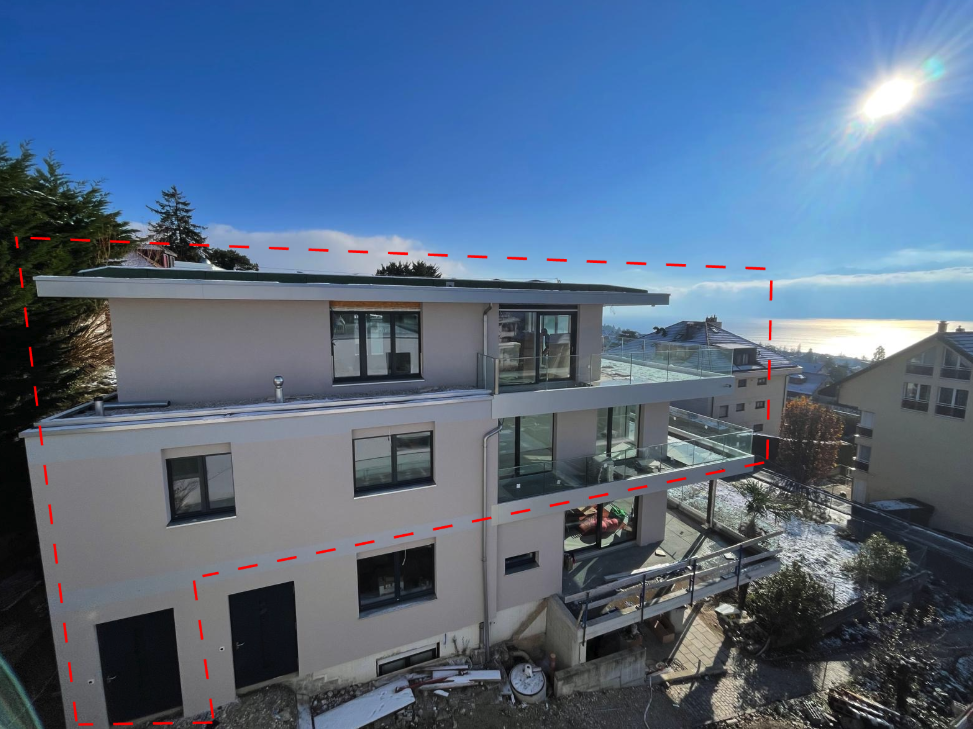
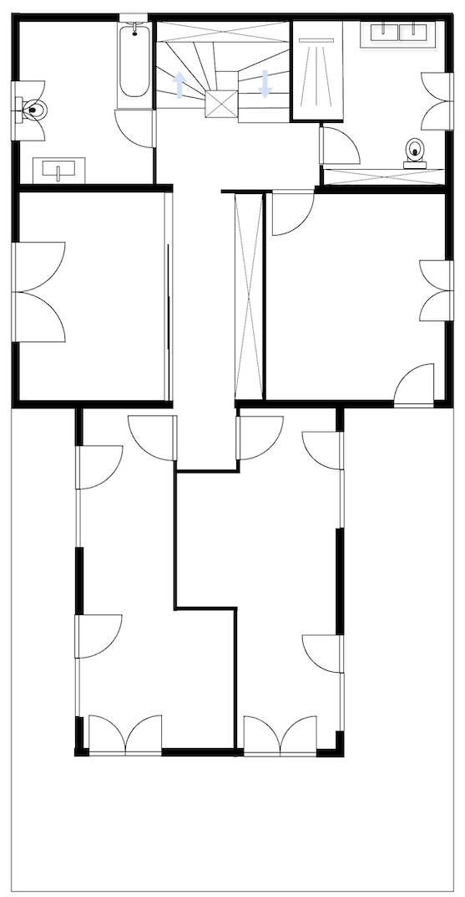
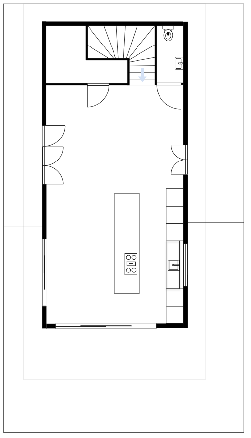
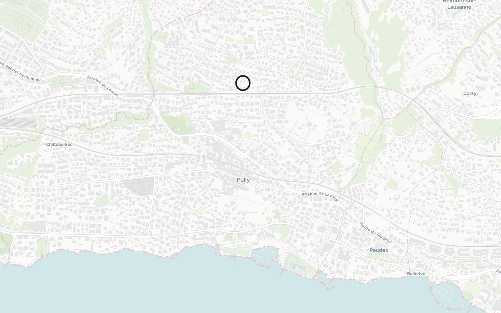
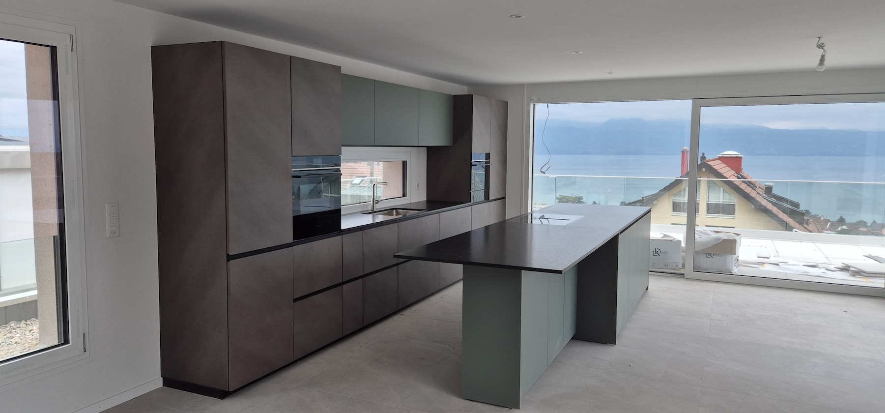
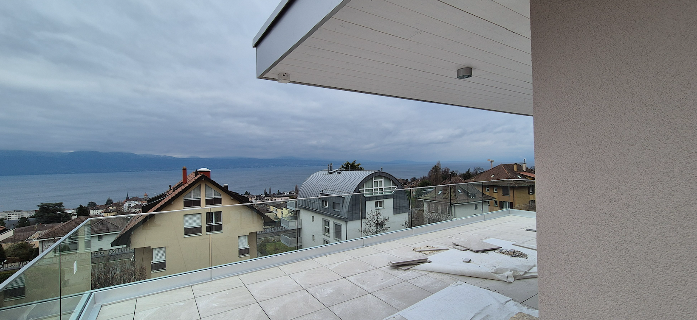
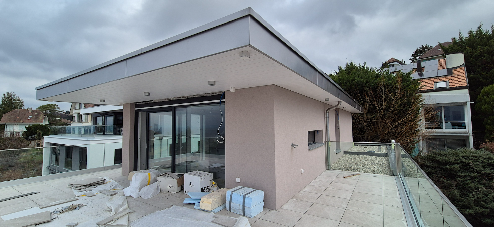
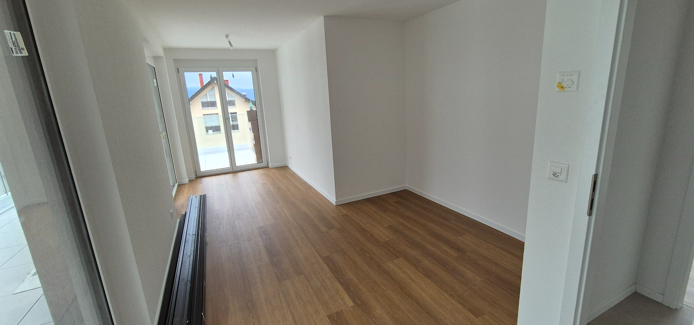
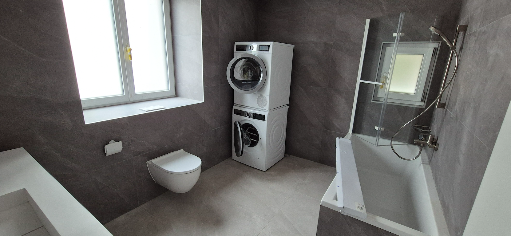

# Villardiez 8 - 1009 Pully

Situé dans une PPE de trois appartements, ce 5,5 pièces en attique offre une terrasse avec vue dégagée sur le lac et les Alpes. Réparti sur deux niveaux, il comprend au premier étage trois chambres à coucher, une chambre polyvalente, deux salles de bain (une avec baignoire et deux douches) ainsi qu’une colonne de lavage dans l’appartement. À l’étage supérieur se trouvent le séjour et la cuisine moderne entièrement équipée avec îlot, bénéficiant d’une vue directe sur le lac.
Le chauffage est assuré par une pompe à chaleur (PAC). L’appartement dispose également d’un garage double (sans accès direct à l’immeuble).
Construction neuve de 2026 (livraison prévue en janvier). L’immeuble ne dispose pas d’ascenseur, mais l’accès se fait de plain-pied.

📐 Surface habitable : 150 m²
📐 Surface terrasse : 99 m²

Plan du 1er étage : 

Plan de l'attique :

## Localisation 
Situé dans un quartier résidentiel calme, le Chemin de Villardiez 8 à Pully bénéficie d’un emplacement privilégié. À quelques minutes à pied du lac Léman, du port, de la plage et de la piscine de Pully, l’adresse offre un équilibre apprécié entre tranquillité et proximité immédiate des commodités. Les transports publics, la gare CFF, les commerces et les écoles sont accessibles en quelques pas, facilitant le quotidien.

Chemin de Villardiez 8 - 1009 Pully 
[Google Maps](https://maps.app.goo.gl/9kYxF44yZEZrgn597) - 

**Commodités à proximité**
- École primaire : 2 min (zone 30 km/h)
- Garderie : 5 min
- Gare CFF de Pully : 2 min
- Arrêt de bus TL : 5 min 
- École secondaire : 10 min
- Terrain de sport : 2 min
- Migros / Coop : 10 min
- Boulangerie : 1 min
*(temps estimé à pied 🦶)*

## Cuisine

📐 47 m²

Cette pièce située au dernier étage offre une vue dégagée sur les environs. Grâce à ses grandes fenêtres, elle bénéficie d’un apport important en lumière naturelle. l’attique offre un espace confortable pouvant servir de séjour, de zone de détente ou de pièce polyvalente selon les besoins.

La cuisine, est de marque **Valcucine**, est équipée d’un plan de travail en granit d’environ 4 mètres, intégrant la zone de cuisson. Elle dispose également d’un espace repas pouvant accueillir jusqu’à six personnes, idéal aussi bien pour le quotidien que pour partager des moments conviviaux.

**Équipements électroménagers**

L’ensemble de l’électroménager appartient à la gamme **Siemens IQ700** et comprend :

- une table à induction avec ventilation intégrée,
- un réfrigérateur,
- un lave-vaisselle,
- un four combiné (air chaud + micro-ondes),
- un four vapeur combiné,
- ainsi qu’un tiroir chauffant.

**Réduit / garde-manger**

Cet espace de rangement pratique permet de stocker les provisions, le matériel ménager ou tout autre équipement, y compris un congélateur si nécessaire.

Il abrite également l’arrivée de la fibre optique, qui est distribuée dans l’ensemble de l’appartement grâce au réseau câblé existant. Toutes les chambres disposent déjà d’une prise Ethernet.

## Terrasse Attique

📐 53 m²

La terrasse de l’attique, exposée plein sud, offre une très belle vue et un véritable espace de détente façon rooftop — les photos parlent d’elles-mêmes.

[Petite vidéo YouTube](https://youtube.com/shorts/pIaGupLhCdc?si=BJ8W3zsVM0GhJPaA)

## Balcon Inférieur

📐 46 m²

Le balcon inférieur dessert les chambres situées au sud, au nord et à l’est.

## Chambres à coucher

📐 14 m² - 15 m² et 16 m²

Deux des trois chambres disposent d’un décrochement permettant d’installer un lit double tout en conservant un espace de circulation confortable. De grandes fenêtres apportent une belle luminosité naturelle.

## Chambre polyvalente

📐 14 m²

Cette chambre est délimitée par une paroi vitrée mobile, ce qui permet de faire évoluer facilement l’usage de la pièce. Elle peut accueillir une chambre d’amis, un bureau, un second salon, un espace de jeu pour les enfants ou même une salle multimédia.
La grande fenêtre offre une belle lumière naturelle, créant une atmosphère agréable et accueillante.

## Salle de bain parentale

📐 8 m²

Salle de bain parentale équipée d’un meuble double vasque en Corian, d’une armoire de rangement et d’un meuble pharmacie intégré dans le mur. Une armoire supplémentaire est également installée sur la face sud, au-dessus des toilettes.

La douche est spacieuse, équipée d’une paroi en verre fixe et d’une porte battante. Ses dimensions sont d’environ 1 m × 1,7 m et elle comprend une douche pluie ainsi qu’une douchette.

## Salle de bain enfant

📐 9 m²

Cette seconde salle de bain dispose d’une baignoire avec paroi vitrée — pratique pour les douches des enfants si nécessaire — ainsi que d’un lavabo simple en Corian. Elle est également équipée d’une machine à laver Bosch et d’un séchoir Bosch Série 8.

# Contact 
Pour toute question ou pour organiser une visite, n’hésitez pas à nous contacter : villardiez8@lonco.ch

