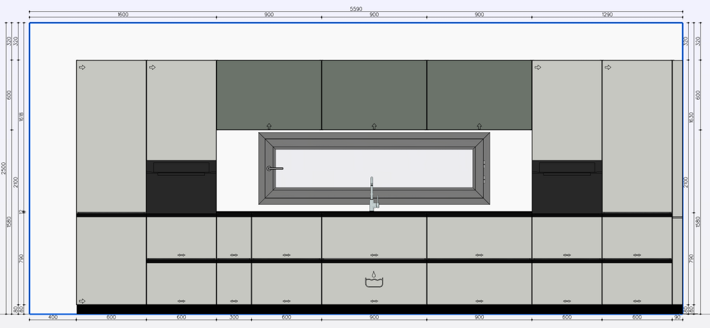
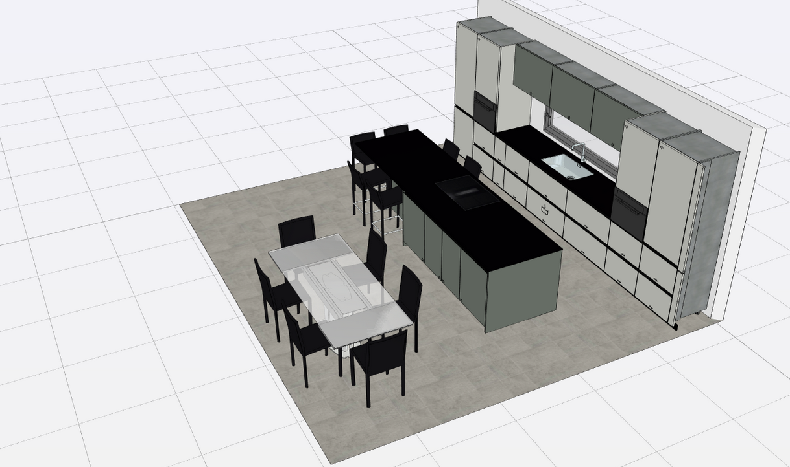

# Cuisine

📐 47 m²

Cette pièce située au dernier étage offre une vue dégagée sur les environs. Grâce à ses grandes fenêtres, elle bénéficie d’un apport important en lumière naturelle. l’attique offre un espace confortable pouvant servir de séjour, de zone de détente ou de pièce polyvalente selon les besoins.

La cuisine, est de marque **Valcucine**, est équipée d’un plan de travail en granit d’environ 4 mètres, intégrant la zone de cuisson. Elle dispose également d’un espace repas pouvant accueillir jusqu’à six personnes, idéal aussi bien pour le quotidien que pour partager des moments conviviaux.

## Équipements électroménagers

L’ensemble de l’électroménager appartient à la gamme **Siemens IQ700** et comprend :

- une table à induction avec ventilation intégrée,
- un réfrigérateur,
- un congélateur,
- un lave-vaisselle,
- un four combiné (air chaud + micro-ondes),
- un four vapeur combiné,
- ainsi qu’un tiroir chauffant.

