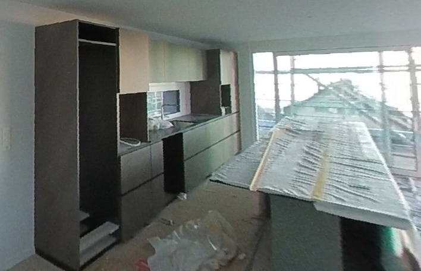

# Attique

📐 

Cette pièce située au dernier étage offre une vue dégagée sur les environs. Grâce à ses grandes fenêtres, elle bénéficie d’un apport important en lumière naturelle. Avec une superficie d’environ **50 m²**, l’attique offre un espace confortable pouvant servir de séjour, de zone de détente ou de pièce polyvalente selon les besoins.

## Cuisine

La cuisine, de marque **Valcucine**, est conçue avec des matériaux durables et des finitions de haute qualité. L’aménagement privilégie l’ergonomie, avec des rangements accessibles, des mécanismes d’ouverture douce et une organisation pratique des zones de préparation, de cuisson et de lavage.

Le **plan de travail en granit, d’une longueur d’environ 10 mètres**, intègre la zone de cuisson et comprend également un espace repas. Celui-ci permet d’accueillir confortablement **jusqu’à six personnes**, ce qui rend la pièce adaptée aussi bien au quotidien qu’aux moments de convivialité.

La cuisine est équipée d’appareils entièrement intégrés de la gamme Siemens, offrant des fonctionnalités avancées pour un usage quotidien.

### Équipements électroménagers

**Four steamer Siemens CD714GX1B**
Four vapeur combiné permettant une cuisson précise et homogène. Il offre des programmes automatiques, un contrôle électronique de la vapeur et une interface claire. Il est adapté à une cuisine saine, en conservant la texture et les nutriments des aliments.

**Table à induction avec ventilation intégrée Siemens EX800NX68E**
Plaque de cuisson à induction avec système d'aspiration intégré. Elle dispose de la technologie *flexInduction* permettant d’adapter la zone de cuisson à la taille des récipients, ainsi que d’un contrôle *dual lightSlider* précis. L’aspiration intégrée élimine les vapeurs directement à la source, sans hotte suspendue.

**Réfrigérateur encastré Siemens KI81RADD0H**
Réfrigérateur grande capacité avec système de conservation avancé pour prolonger la fraîcheur des aliments. Éclairage LED homogène, clayettes en verre robustes et compartiments modulables pour un rangement optimisé. Température stable grâce à un système de réfrigération uniforme.

**Lave-vaisselle Siemens SX65EX11CE**
Modèle entièrement intégrable, silencieux, équipé de programmes automatiques et d’un système de capteurs pour ajuster la consommation d’eau. La fonction *varioSpeed Plus* réduit le temps de lavage. Tiroir supérieur modulable pour accueillir ustensiles ou verres longs. Convient bien aux espaces ouverts grâce à son faible niveau sonore.

**Four combiné micro-ondes Siemens HM736G1B1C**
Four combiné regroupant les fonctions d’un four traditionnel et d’un micro-ondes. Les modes combinés (air chaud + micro-ondes) permettent des cuissons rapides et régulières. Il inclut des programmes automatiques et un contrôle précis de la température. Cavité inox pour une bonne durabilité.

**Tiroir chauffant Siemens BI910C1B1C**
Tiroir permettant de maintenir les plats au chaud, de préchauffer la vaisselle ou d’effectuer des cuissons lentes et à basse température. Température réglable sur plusieurs niveaux. Intégré sous les fours pour un usage pratique au quotidien.

### Matériaux et ergonomie

Les surfaces en granit, le mobilier Valcucine et les finitions en verre ou métal assurent une bonne durabilité et une facilité d’entretien. Les appareils Siemens garantissent une utilisation simple et fiable, avec des commandes intuitives et des performances stables.

L’ensemble forme une cuisine fonctionnelle, bien organisée et intégrée harmonieusement à l’espace de vie.
